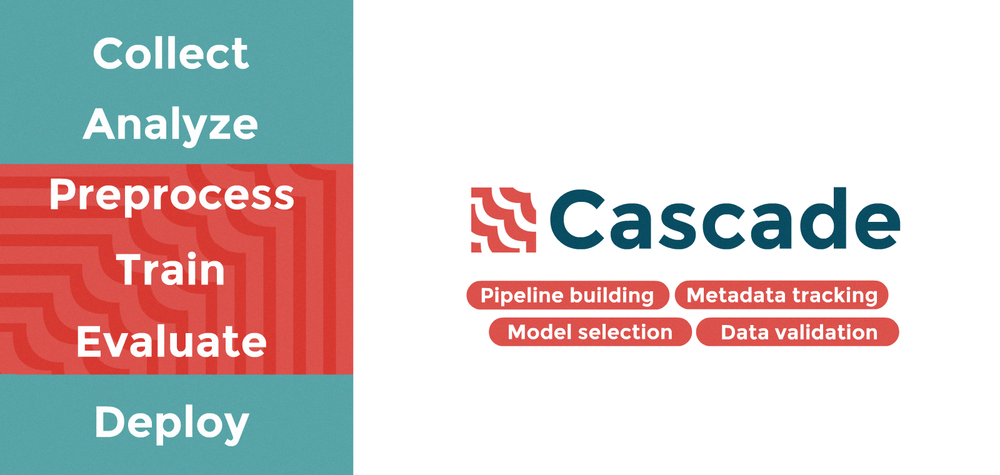

[](https://pepy.tech/project/cascade-ml)

ML Engineering library with the aim to standardize the work with data and models, make experiments more reproducible, ML development more fast.  

This project is an attempt to build such bundle of tools for ML-Engineer, certain standards and guides for 
workflow, a set of templates for typical tasks.


## Installation
```bash
pip install cascade-ml
```
More info on installation can be found in [docs](https://oxid15.github.io/cascade/quickstart.html#installation)


## Usage

See use-cases in [documentation](https://oxid15.github.io/cascade/quickstart.html).


## Why Cascade

Cascade emerged as an attempt to bring order into messy and fast-paced ML-engineering workflow.  

As a part of small AI-team I encountered *typical problems* for those who run a lot of fast experiments on datasets and models with no strict system, which are:

 * Growing number of different versions of data pipeline
 * Growing number of different versions of models
 * Folders with hundreds of models as binary artifacts with no info about what is inside
 * History of model's metrics is not present
 * Data pipelines and model trainloops are difficult to reuse
 * New data coming to the training stage passes without verification 


### This project aims to address this kind of issues by:

 * Making data pipelines modular, traceable and verifiable with little or no additional code
 * Making models more than black-box binary artifacts
 * Introducing tools for storing and accessing meta data, parameters and metrics


## Why not other solutions

For ML-Engineering teams there are a number of tools available, which are:
 * [mlflow](https://mlflow.org/)
 * [DVC](https://dvc.org/)
 * [neptune.ai](https://neptune.ai/)
 * [zenml](https://github.com/zenml-io/zenml)

These are great tools for their own purposes, however with their own weaknesses
 * A lot of imperative meta-code
 * The need to restructure your pipelines to fit in the system
 * No support for tracing data-pipelines
 * No focus on what is inside data processing scripts, only on MLOps meta-code
 * Difficult to manage quick experiments, prototypes


## Who could find Cascade useful

Small and fast-prototyping AI-teams could use it as a tradeoff between total missingness of any ML-Engineering framework and demanding enterprise solutions.


## Principles

The key principles of Cascade are:
 * **Elegancy** - ML-pipelines code should be about ML with minimum meta-code
 * **Agility** - it should be easy to build new prototypes and integrate existing project with Cascade
 * **Reusability** - code should have an ability to be reused in similar projects with little or no effort
 * **Traceability** - everything should have meta-data

The logo of the project is a depiction of these principles: it symbolizes modularity, standardization, information flow and is cascade-like :)


## Scope



Cascade is focused around model's lifecycle and data preprocessing pipelines. It provides tools for construction of data processing pipelines, model training and management of trained model's metadata and files.


## Contributing

Pull requests and issues are welcome! For major changes, please open an issue first to discuss what you would like to change.

Please make sure to update tests and docs as appropriate.


## Documentation
---
[Go to Cascade documentation](https://oxid15.github.io/cascade/)


## Structure

Cascade is divided into four main modules namely: `base`, `data`, `models` and `meta`  

- `base` is a module of some base interfaces and classes 
- `data` aims to provide OOP-solution to the problem of building complex data-pipelines
- `models` provides standardized way of dealing with ML-models, train, evaluate, save, load, etc...
- `meta` ensures that all relevant meta info about data and models is stored and can be easily viewed

There is also `utils` which is a collection of useful Datasets and Models which are too specific to add them to the core.


## License

[Apache License 2.0](https://choosealicense.com/licenses/apache-2.0/) 


## Versions

This project uses Semantic Versioning - https://semver.org/


