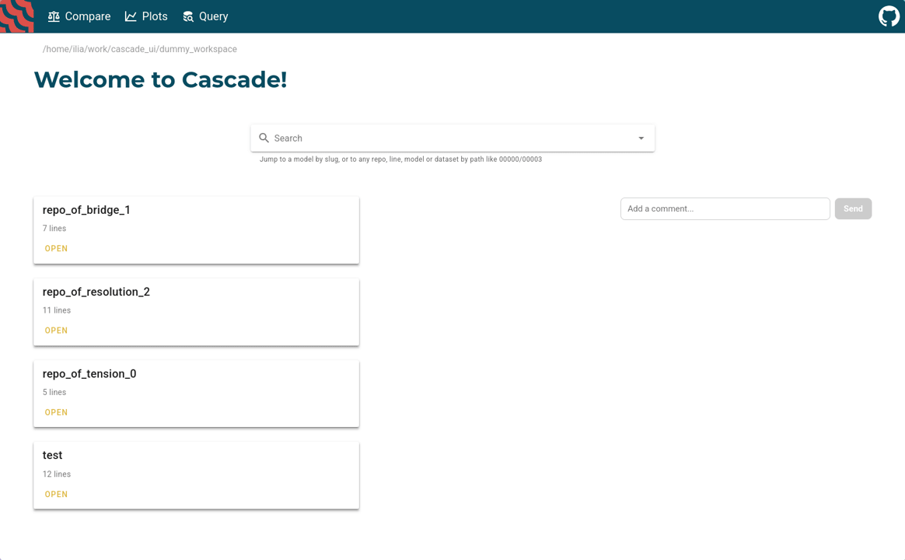

# Cascade - Small-scale MLOps Library

Cascade is MLOps for projects that don't need an MLOps platform


[](https://pepy.tech/project/cascade-ml)
[](https://zenodo.org/badge/latestdoi/460920693)


Track experiments, datasets, models and artifacts locally with Python and your filesystem. No tracking server, cloud account or complex infrastructure required.

**Included in [Model Lifecycle](https://github.com/kelvins/awesome-mlops#model-lifecycle) section of Awesome MLOps list**

## Installation

```bash
pip install cascade-ml
```

More info on installation can be found in [documentation](https://oxid15.github.io/cascade/en/latest/)

## Local UI

```bash
pip install cascade-ui
```

Just do ``cascade ui`` to get a nice dashboard for your experiments.



[Cascade UI](https://github.com/Laiserk/cascade_ui) is a separate project, that provides visual interface for Cascade experiments. For more detailed explanation you can visit [UI docs](https://oxid15.github.io/cascade/en/latest/tutorials/ui.html).


## Docs

[Go to Cascade documentation](https://oxid15.github.io/cascade/en/latest)

## Usage Examples

This section is divided into blocks based on what problem you can solve using Cascade. These are the simplest examples
of what the library is capable of. See more in documentation.

### ETL pipeline tracking

Data processing pipelines need to be versioned and tracked as a part of model experiments.  
To track changes and version everything about data Cascade has `Datasets` - special wrappers
that encapsulate operations on data.

```python
from pprint import pprint
from cascade import data as cdd
from sklearn.datasets import load_digits
import numpy as np


X, y = load_digits(return_X_y=True)
data = [{"x": x, "y": y} for x, y in zip(X, y)]

ds = cdd.Wrapper(data)
ds = cdd.RandomSampler(ds)

train_ds, test_ds = cdd.split(ds)
train_ds = cdd.ApplyModifier(
    train_ds,
    lambda item: {"x": item["x"] + np.random.random(), "y": item["y"]}
)

pprint(train_ds.get_meta())
```

We see all the stages that we did in meta.

```json
[{"comments": [],
  "description": null,
  "len": 898,
  "links": [],
  "name": "cascade.data.apply_modifier.ApplyModifier",
  "tags": [],
  "type": "dataset"},
 {"comments": [],
  "description": null,
  "len": 898,
  "links": [],
  "name": "cascade.data.range_sampler.RangeSampler",
  "tags": [],
  "type": "dataset"},
 {"comments": [],
  "description": null,
  "len": 1797,
  "links": [],
  "name": "cascade.data.random_sampler.RandomSampler",
  "tags": [],
  "type": "dataset"},
 {"comments": [],
  "description": null,
  "len": 1797,
  "links": [],
  "name": "cascade.data.dataset.Wrapper",
  "obj_type": "<class 'list'>",
  "tags": [],
  "type": "dataset"}]
```

See all datasets in [zoo](https://oxid15.github.io/cascade/en/latest/modules/dataset_zoo.html)  
See tutorial in [documentation](https://oxid15.github.io/cascade/en/latest/tutorials/tutorials.html)

### Experiment tracking

Cascade provides a rich set of ML-experiment tracking tools.
You can easily track history of model changes, save and restore models
in a structured manner along with metadata.

```python
import random
from cascade.models import Model
from cascade.repos import Repo

model = Model()
model.add_metric("acc", random.random())
model.tag("production")
model.describe("I tried to do X in this experiment")
model.params["lr"] = 1e-4

repo = Repo("./repo")

line = repo.add_line('baseline')
line.save(model, only_meta=True)
```

`Repo` is the collection of lines and `Line` can be a bunch of experiments on one model type.
Lines can also store data pipelines.

```json
[
    [
        {
            "comments": [],
            "created_at": "2026-07-25T21:24:39.783748+00:00",
            "description": "I tried to do X in this experiment",
            "host": "your-pc-name",
            "links": [],
            "metrics": [{"created_at": "2026-07-25T21:24:39.784872+00:00",
                        "name": "acc",
                        "value": 0.5284442363543276}],
            "name": "cascade.models.model.Model",
            "params": {"lr": 0.0001},
            "path": "/home/ilia/work/cascade/repo/baseline/00000",
            "python_version": "3.12.3 (main, Mar 23 2026, 19:04:32) [GCC 13.3.0]",
            "saved_at": "2026-07-25T21:24:41.753499+00:00",
            "slug": "victorious_dingo_of_will",
            "tags": ["production"],
            "type": "model",
            "user": "ilia"
        }
    ]
]
```

See tutorial in [documentation](https://oxid15.github.io/cascade/en/latest/tutorials/tutorials.html)

## Who could find Cascade useful

ML engineers and researchers in small teams or working individually.
The price of integrating with large-scale MLOps solutions can be too high and the aim of
Cascade is to bridge this gap for everyone.

## Principles

The key principles of Cascade are:

* **Elegance** - ML code should be about ML with minimum meta-code
* **Flexibility** - to easily build prototypes and integrate existing projects with Cascade *(don't pay for what you don't use)*
* **Reusability** - code to be reused in similar projects with no effort
* **Traceability** - everything should have meta-data

## Contributing

Pull requests and issues are welcome! For major changes, please open an issue first to discuss what you would like to change.

Please make sure to update tests and docs as appropriate, see [CONTRIBUTING.md](CONTRIBUTING.md).

## License

[Apache License 2.0](https://choosealicense.com/licenses/apache-2.0/)

## Versions

This project uses Semantic Versioning - <https://semver.org/>

## Changelog

See [CHANGELOG.md](CHANGELOG.md)

## Cite the code

If you used the code in your research, please cite it with:  
  
[](https://zenodo.org/badge/latestdoi/460920693)

```bibtex
@software{ilia_moiseev_2023_8006995,
  author       = {Ilia Moiseev},
  title        = {Oxid15/cascade: Lightweight ML Engineering library},
  month        = jun,
  year         = 2023,
  publisher    = {Zenodo},
  doi          = {10.5281/zenodo.8006995},
  url          = {https://doi.org/10.5281/zenodo.8006995}
}
```


